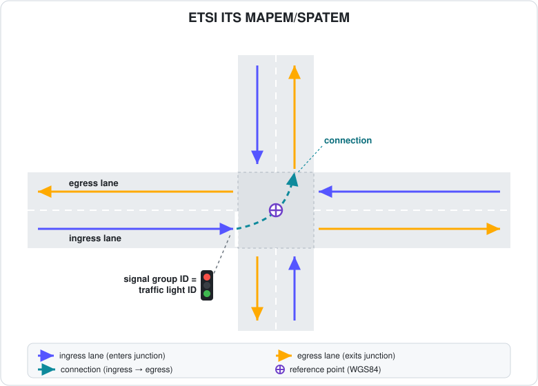

# ETSI ITS Conversion

The [Traffic Lights Sensor][trafficlightssensor] of the `carla_ros_bridge` package can convert the junction topology and traffic light states of the CARLA world into ETSI ITS messages, as specified in [ETSI TS 103 301 V2.1.1][ts103301] (the lane topology below follows Figure 5 of that document). When enabled it publishes two message formats from [`etsi_its_messages`][etsimsgs]: __MAPEM__ (intersection geometry: reference point, ingress/egress lanes and their connections) and __SPATEM__ (the current phase of every traffic light, linked to the MAPEM geometry via the signal group). The conversion is disabled by default.

[trafficlightssensor]: ros_sensors.md#traffic-lights-sensor
[etsimsgs]: https://github.com/ika-rwth-aachen/etsi_its_messages
[ts103301]: https://www.etsi.org/deliver/etsi_ts/103300_103399/103301/02.01.01_60/ts_103301v020101p.pdf



- [__Requirements__](#requirements)
- [__Parameters__](#parameters)
- [__ROS API__](#ros-api)
    - [Publications](#publications)

---

## Requirements

The ETSI conversion runs inside the `sensor.pseudo.traffic_lights` pseudo-sensor, so it has to be present as a global sensor in `carla-simulation/config/carla_ros_bridge/objects/global-sensors.json`:

```json
{
    "type": "sensor.pseudo.traffic_lights",
    "id": "traffic_lights"
}
```

See [Carla Spawn Objects](carla_spawn_objects.md) for how sensors are spawned.

---

## Parameters

Set `publish_etsi_messages` to `True` to enable the conversion. These are bridge launch parameters; the central list is in [The ROS Bridge package](run_ros.md#configuring-carla-settings).

| Parameter | Default | Description |
|-----------|---------|-------------|
| `publish_etsi_messages` | `False` | Enables publication of the MAPEM and SPATEM messages. When `False` (default), the conversion is inactive and incurs no runtime cost. |
| `mapem_timer_period` | `1.0` | Publication period of the MAPEM (intersection geometry) in seconds. The geometry is static, so a long period is normally sufficient. |
| `spatem_timer_period` | `0.1` | Publication period of the SPATEM (signal phases) in seconds. Signal states are time-varying and are therefore published at a higher rate than the MAPEM. |
| `integrate_all_junctions` | `False` | Selects which junctions are included in the MAPEM. `True` includes all junctions of the map; `False` (default) includes only junctions that contain traffic lights. |
| `waypoints_search_distance` | `1.0` | Approximate distance in meters between sampled waypoints, and therefore the spacing of the MAPEM lane nodes. |
| `lane_waypoints_count` | `10` | Number of nodes generated per MAPEM ingress/egress lane. Combined with `waypoints_search_distance`, it determines the lane length (approximately `lane_waypoints_count` × `waypoints_search_distance` meters). |

<br>

---

## ROS API

#### Publications

| Topic | Type | Description |
|-------|------|-------------|
| `/carla/etsi/mapem` | [`etsi_its_mapem_ts_msgs/MAPEM`][etsimsgs] | Geometry of all included intersections (reference point, lanes, connections, signal groups). |
| `/carla/etsi/spatem` | [`etsi_its_spatem_ts_msgs/SPATEM`][etsimsgs] | Current signal phase of every traffic light, grouped per intersection. |

<br>
